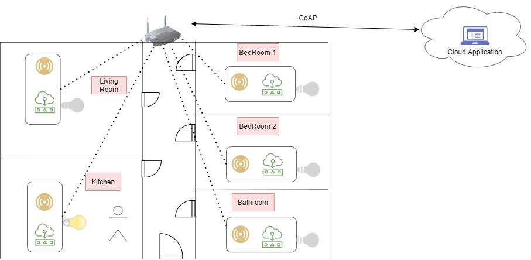

# SmartLight Application

SmartLight is a simple application developed for the IOT exam.

## 1. Introduction
It is an environment deployed in a house consisting of one device per each room, plus a special device in charge of acting as a border router.

The house structure used for this application is a simple house, with 5 rooms : **Bedroom 1**, **Bedroom 2**, **Livingroom**, **Bathroom**, **Kitchen**.

The application in mainly based on the idea of switch ON the light in a room whenever a person enter in the room, and switch OFF whenever no one is in the room.

For this aim, each device exposes 2 resources : 
- **res_presence:** act as a sensor for the detection of a presence in that room.
- **res-light:** act as an actuator, to switch ON/OFF the light in that room.