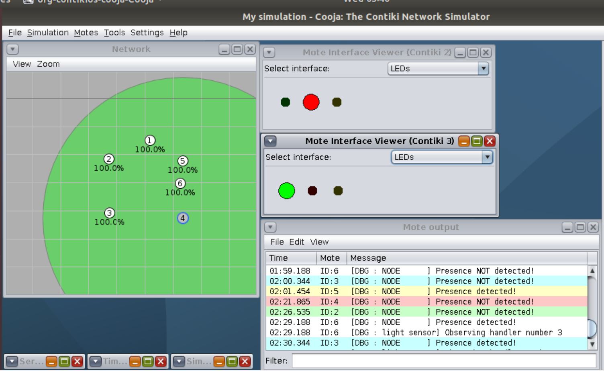

# SmartLight Application

SmartLight is a simple application developed for the IOT exam.

## 1. Introduction
It is an environment deployed in a house consisting of one device per each room, plus a special device in charge of acting as a border router. 

The border router talks with a cloud application developed on the VM.

The house structure used for this application is a simple house, with 5 rooms : **Bedroom 1**, **Bedroom 2**, **Livingroom**, **Bathroom**, **Kitchen**.

The application in mainly based on the idea of switch ON the light in a room whenever a person enter in the room, and switch OFF whenever no one is in the room.

For this aim, each device exposes 2 resources: 
- **res_presence:** act as a sensor for the detection of a presence in that room.
- **res_light:** act as an actuator, to switch ON/OFF the light in that room.

## The Application

The application exposes a command line interface to interact with the devices.

The main menù offers the possibility of:
### Get the resources information:
Show for every room, the state of each resource.

After a small time to wait due to the registration phase, the user can insert the '1' command to see the resources. At the beginning of the program, all lights are **OFF**, and all presences are set to **No**.

### Modify a light state 
Allows the user to switch ON/OFF the light in a room, after inserting the node id corresponding to a room.

At the end of the function, a string will show the correctness of the process, with the new state changed.

### Observe resources Mode
Allows the user to being updated with the current states and changes of the resources. The updates arrives, for each device, every 60 seconds, and after every change in a state (***trigger***). 
The user will see also the timestamp corresponding to each update.

The user can exit form this mode just inserting the '0' plus the Enter key.

## Sensors and Actuators

The behaviour of the sensor is emulated in this project using a **random** function that generates a value every 30 seconds . In particular I defined a threshold (50), and if the value generated is equal or above the threshold means that a presence is detected in that room and the light will be switched ON, otherwise anyone is in the room and the light will be switched OFF.

At anytime the user can check the light status also from the Cooja interface, using the LED interface on each device.

The green led corresponds to a ON light, the red one to a OFF light.

